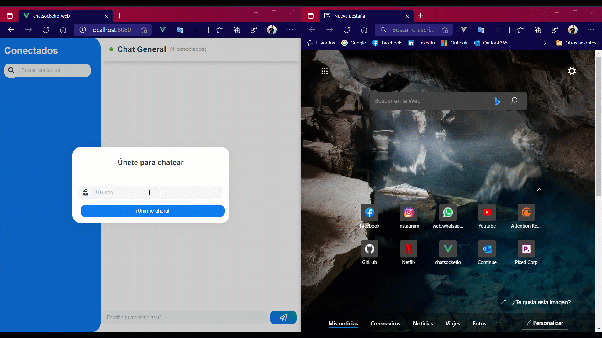

# Chat using Socket.io
Simple web application that allows real-time messaging using socket.io and Vue.js

<p align="center">
  
</p>

## Features
```
- Join with username.
- Send and receive messages in real time.
- Counter about number of connected users.
- "Someone is writing" text.
- Search between connected users.
```

## Getting started

### Clone the project
```
git clone https://github.com/Jhomalex/chatsocketio-web
```

### Enter the project directory
```
cd chatsocketio-web
```

### Install dependency
```
npm install
```

### Develop
```
npm run serve
```
This will auttomatically open http://localhost:8080

